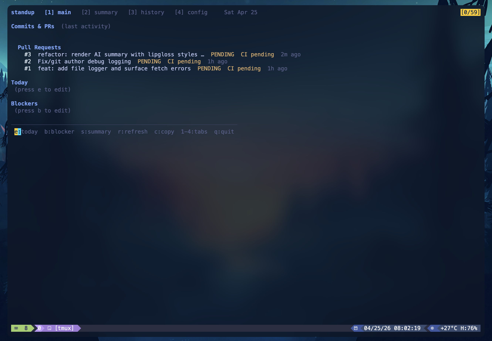
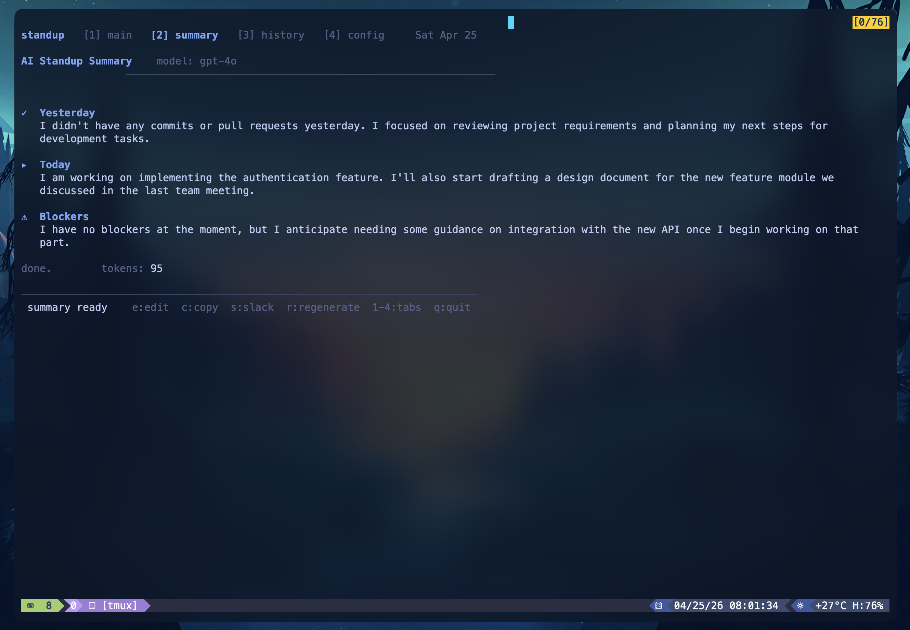
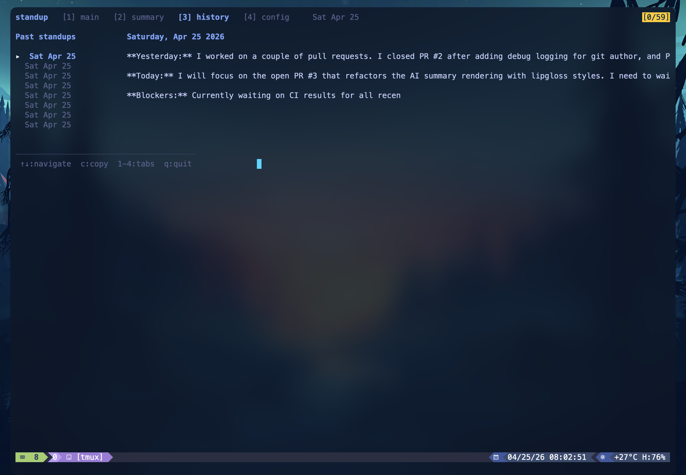
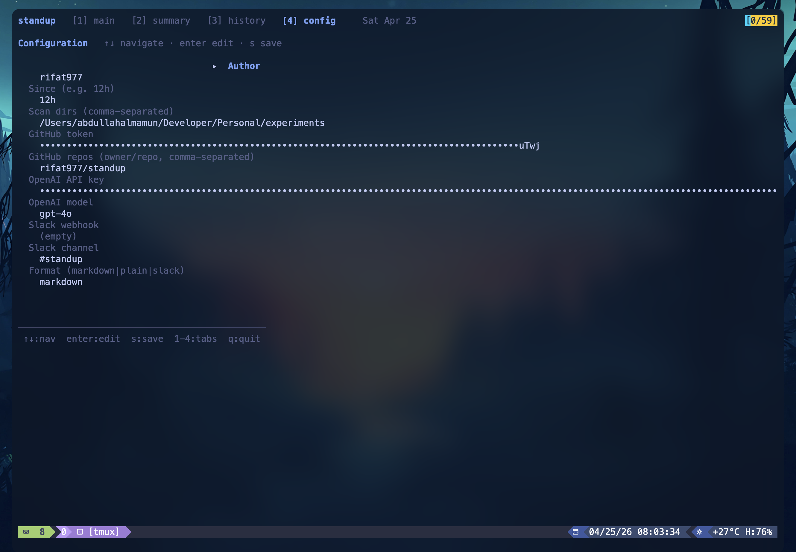

# standup

Terminal CLI that gathers your last 12 hours of git commits and GitHub PRs, lets you add today's plan and blockers, and uses OpenAI to generate a clean standup note — one keypress, done.



## Overview

`standup` is a terminal app for daily updates. It:

- Scans recent local git activity across your configured repos
- Pulls open PR status from GitHub
- Lets you write today's focus and blockers inline
- Generates a ready-to-share standup summary in markdown or plain text

The TUI is organized into four tabs — main, summary, history, and config — shown in the screenshots below.

## Install

```bash
go install github.com/rifat977/standup/cmd/standup@latest
```

Or build from source:

```bash
git clone https://github.com/rifat977/standup
cd standup
go build -o standup ./cmd/standup
```

## Quickstart

```bash
standup init                       # writes ~/.standup/config.yaml
$EDITOR ~/.standup/config.yaml     # add GitHub token, OpenAI key, repos
standup                            # opens the TUI
```

### Keybindings

Tabs: `1` main · `2` summary · `3` history · `4` config

On the main view:

| Key | Action |
|-----|--------|
| `e` | Edit *Today* |
| `b` | Edit *Blockers* |
| `s` | Generate AI summary |
| `r` | Refresh |
| `c` | Copy |
| `q` | Quit |

## Non-interactive usage

```bash
standup show --no-ai      # raw commit + PR dump
standup show              # generate via OpenAI, print to stdout
standup --plain           # plain text (good for piping)
standup --since 24h       # widen the window
```

## Config

Lives at `~/.standup/config.yaml`. Overrides via env: `OPENAI_API_KEY`, `GITHUB_TOKEN`, `SLACK_WEBHOOK_URL`.

See `config.example.yaml` for the full schema.

## Screenshots

Real outputs from the tool UI.

**Main tab** — recent commits, open PRs, today's plan and blockers.


**Summary tab** — AI-generated standup note.



**History tab** — past standups.



**Config tab** — tokens, repos, model settings.



## Stack

Go · [bubbletea](https://github.com/charmbracelet/bubbletea) · [lipgloss](https://github.com/charmbracelet/lipgloss) · [go-openai](https://github.com/sashabaranov/go-openai) · [go-github](https://github.com/google/go-github)
